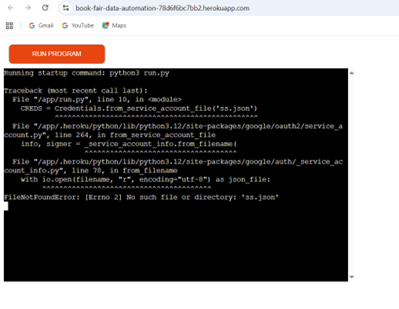
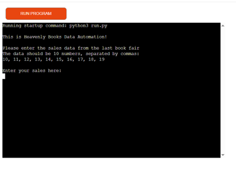
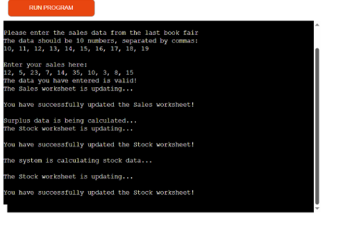
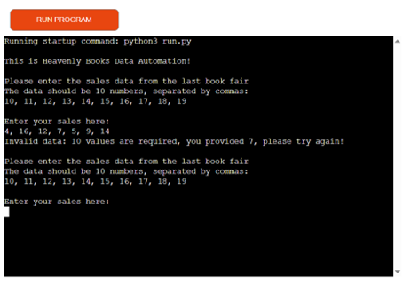
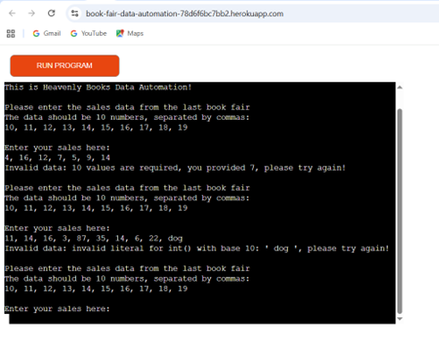
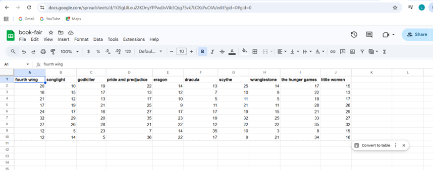

# 'Heavenly Books' Book Fair Data Automation Programme

- This data automation programme allows the seller of Heavenly Books to store their stock data within a Google Sheet, link that data up with the python programme and make automatic adjustments to the stock numbers after each book fair.
- The programme is fully automated and the user will only need to enter certain commands to retrieve the information they are searching for. If the data they enter does not match the criteria, a message will appear guiding them on what the data should look like. New data will then be added into the linked Google Sheet.

## Features
### Existing Features 
- The programme is able to retrieve data from the Google Sheet.

- It allows users to enter new sales figures from a recent book fair.

- The programme can also calculate surplus stock from the Google Sheet. This is done by subtracting the book sales figures from the stock figures. Positive surplus represents books that were not bought, while negative surplus represents books that had to be ordered in for the customer because they had sold out.

- The next feature collects the sales figures from the last five data entries and presents the data as a list to the user.

- The final feature of this data automation programme calculates the stock average for each book and adds 10% to that figure.

## Future Features 
- A future ambition for this project would be to create this data automation on a much bigger scale, not just including the data from a book fair but also the book shop. The book fair data and the book shop data could then be linked and the data added after each book fair could be automatically added to the figures from the shop. Thus further altering the surplus numbers and stock average. A command could be run to tell the user how much stock they should take from the book shop to the fair each month. 

- Another interesting route would be to have the programme forecasting the sales necessary over the next month, or even year, to ensure a profit for a seller.

## Testing 
### Bugs encountered during the coding process

- When I added the command to produce an error message if the user did not enter the correct data, I found that the error message was not appearing in the vscode terminal. After altering the code a few times in an attempt to fix the bug, I realised that I had made the simple error of not saving my code in the python file, so the programme was running an old version that did not produce the error message.

- During the testing stage for the command that converted the strings into integers, a red error message was being thrown in the vscode terminal. All of my code was correct so I could not figure out what mistake I had made. I used ChatGPT to help me realise that I had not indented the code properly. I unfortunately made this mistake a couple of times during this project, but I have ensured that all of the code is now correctly indented.

- Another major bug that I encountered was that my Google Sheet was not being updated with the new figures. To help me with this issue, I looked back at the Love Sandwiches project with Code Institute and found that while I had created the command, I had not made a call to it later in the code. That was fixed by adding 'update_sales_worksheet(sales_data)'.

- I copied my code straight into the PEP8 Python Validator. At first I had quite a few error messages, however they were simple fixes. Mostly regarding whitespace or not enough blank lines between commands. Once I corrected those, there were no errors left in my code as you can see from the image below. 

- After I had deployed my project in Heroku I was still faced with an error message in the app: 

- I discovered that I had forgotten to copy over my ss.json file into the new project. I then created this file but also forgot to add it into the gitignore file. Because of this my changes were not being pushed to GitHub because of the sensitive information within the credentials. To resolve this issue I deleted the 'ss.json' commit history so that I could work with a new ss.json file. 

- Despite that fix, the next issue I had to face was that the credentials on my Heroku config vars did not link up to my vscode credentials and they were not being found when the app was run. To help resolve this issue I used ChatGPT. ChatGPT recommended a change is my python code so that the credentials could by found in the vscode. I used the following code provided by ChatGPT to fix this bug: 
import os
import json
creds_dict = json.loads(os.environ["SS"])
CREDS = Credentials.from_service_account_info(creds_dict)

- The final problem I encountered when trying to get my app to work was that my bug fixes had been uploaded to GitHub but not to Heroku. I contacted a tutor from Code Institute to help me understand the problem. I was informed that all I had to do was re-deploy the project on Heroku with the fixed code from the Github repository. I have provided an image below of the app displaying the correct output:

### Testing the working app

- To test that my app was working correctly I entered some mock data into the terminal and the correct message was displayed:

- I then tested that if I entered insufficient data, the correct error message would be presented to the user.

- I also tested that if an incorrect form of data was entered, for example a word instead of a number, that the appropriate message would be displayed for that.

-Finally I entered another set of valid mock data and checked that the book-fair spreadsheet was being updated, which it was. The table had an extra two lines of data from the information that I had entered during testing:

## Deployment 

- I have had many issues when it comes to the deployment of my project on Heroku. My original repository was not being recognised and I followed the steps recommended by the site, however after meeting with a mentor I was informed that my original file was too corrupted with errors to be deployed. I had also forgotten to include a 'Procfile'. After attempting to fix my original project we still could not get it uploaded on Heroku as it could not recognise my venv. My mentor provided me with the Code Institute template so that I could copy my project into the template and hopefully have a suitable repository to connect and deploy.

- For this newly created repository, my contributions to the commits are very few because most of my own work I have copied straight in from the original project. So I have provided the link to the original github repository for evidence of my creation of the actual code: https://github.com/LaurenForster25/book-fair.git

- This is the link to the Github repository of the project that is working and deployed to Heroku: https://github.com/LaurenForster25/book-fair-version-two.git

- I have now deployed my working app on Heroku by linking my updated github repository 'book-fair-version-two'. Here is the link: https://git.heroku.com/book-fair-data-automation.git

## Credits

- Code Institute for providing a data model that I could use to guide me through this project and the template that has helped me deploy my project.
- Julia Konovalova, the mentor who helped me understand the issues with my original project and guided me through the solution so that I could deploy my work.
- Tom from the tutor assistance chat who helped me to successfully re-deploy the new working app.
- ChatGPT for providing answers to help me fix some minor bugs, where incorrect indentation was used and words were mispelt. Also for helping me understand why my Heroku credentials were not linked up with those in the vscode.
